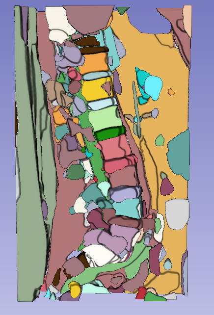
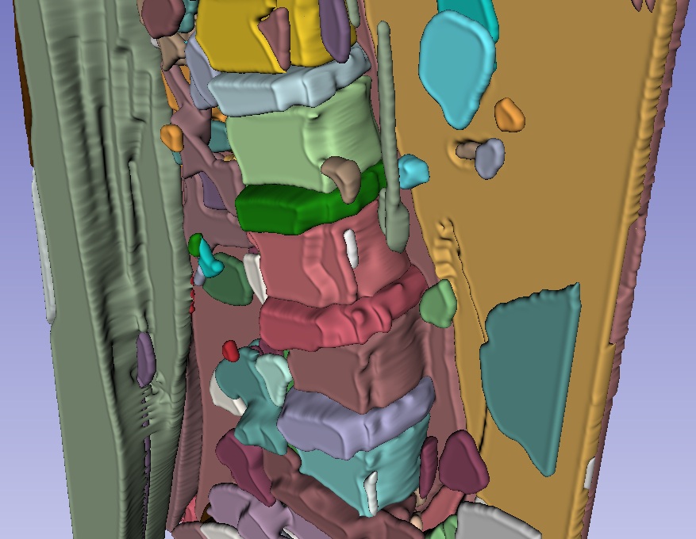

# Segment-Anything-Automatically-on-Medical-Image (SAAMI)

[](https://github.com/MIC-DKFZ/napari-sam/raw/main/LICENSE)


This project uses Meta AI's new **Segment Anything Model (SAM)** to autmoatically genrate 3D masks. This is a simple project that helps the user visualize the automaticlly generated segmentation using the ``SamAutomaticMaskGenerator`` function on medical images. 


**No more prompting needed to generate 3D medical masks!**


SAAMI automatically matches the labels generated from the 2D masks in each slices to create a consistent and consecutive 3D mask given a 3D input image. The automaticlly generated 3D masks could be useful for further neural network training and fine-tuning in a semi-supervised fashion.

An example is shown below. MRI segmentation is a hard task compared to CT segmentation due to the varying contrast under different imaging sequence used, and signal intensity is not standardized and can vary between scanners, imaging protocols, and patients. Using SAAMI the unsupervised 3D masks could be acquired as shown below:


Automatically generated 3D Mask in 3D Slicer (1)       |  Automatically generated 3D Mask in 3D Slicer (2)  
:-------------------------:|:-------------------------:
  |  


SAAMI provides a ipywidget visualization as follow:


The algorithm to automatically match the labels and fine-tuning of the labels is work in progress.

## Installation

To install the dependencies required for "Segment-Anything-Automatically-on-Medical-Image":

- Open a terminal or command prompt.

- Navigate to the directory where the "Segment-Anything-Automatically-on-Medical-Image" project is located.

- Run the following command to install the required dependencies:

```bash
pip install -r requirements.txt
```

### Data Folder Structure
Currently, the folder should be organized as follow: 

```css
--- DATA_DIR
  |--- patient_00
  |   |--- Images
  |   |   |--- 3D_image.nii
  |   |
  |   |--- Labels
  |   |   |--- 01.nii
  |   |   |--- 02.nii
  |   |   |--- ...
  |   
  |--- patient_01
  |   |--- Images
  |   |   |--- 3D_image.nii
  |   |
  |   |--- Labels
  |   |   |--- 01.nii
  |   |   |--- 02.nii
  |   |   |--- ...
```

## Usage

You can run testing on a MRI spine dataset using the following command:
```python
# Import SAAMI 
from saami.SAAMI import SAAMI

# Load the 3D Volumetric data from DATA_DIR 
SAAMIdata = SAAMI('data/MRI_example')

# Calculates 3D mask for the first volume (idx = 0)
mask = SAAMIdata.calculate_3d_mask(0)

# Fine-tune 3D mask for the first volume
new_mask = SAAMIdata.finetune_3d_mask(0)

# Save 3D mask for the first volume
SAAMIdata.save_mask(0, save_path='outputs/saved_mask.nii')

# visualization for the first volume
SAAMIdata.visualize(0)

```

You can also run the `example.py` script directly in the terminal. This will save the predicted mask under the outputs folder and will launch the ipywidget for visualization.

```bash
python example.py
```

Enjoy!

## Contact
Contact me (pku1@jh.edu) if you encounter an issue.

## License

Distributed under the terms of the [Apache Software License 2.0] license,
"saami" is free and open source software
