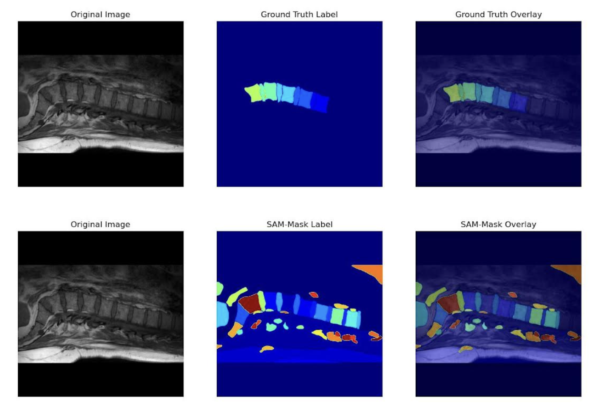

# Segment-Anything-Automatically-on-Medical-Image (SAAMI)

[](https://github.com/MIC-DKFZ/napari-sam/raw/main/LICENSE)

Automatically segment anything on 3D medical images using Meta AI's new **Segment Anything Model (SAM)**. This is a simple project that helps the user visualize the automaticlly generated segmentation using the ``SamAutomaticMaskGenerator`` function on medical images. 


SAAMI automatically matches the labels generated from the 2D masks in each slices to create a consistent and consecutive 3D mask given a 3D input image. The automaticlly generated 3D masks could be useful for further neural network training and fine-tuning in a semi-supervised fashion.


SAAMI provides a GUI visualization as follow:


Automatically generated 3D Mask View 1             |  Automatically generated 3D Mask View 2 
:-------------------------:|:-------------------------:
  |  


The algorithm to automatically match the labels and fine-tuning of the labels is work in progress.

## Installation

To install the dependencies required for "Segment-Anything-Automatically-on-Medical-Image":

- Open a terminal or command prompt.

- Navigate to the directory where the "Segment-Anything-Automatically-on-Medical-Image" project is located.

- Run the following command to install the required dependencies:

```bash
pip install -r requirements.txt
```

## Usage

You can run testing on a MRI spine dataset using the following command:
```bash
python sammmi_example.py
```
Detailed usages to be shared soon.

## License

Distributed under the terms of the [Apache Software License 2.0] license,
"saami" is free and open source software
